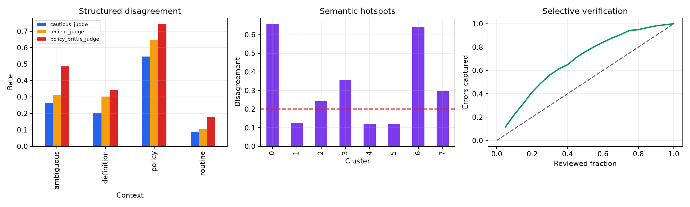
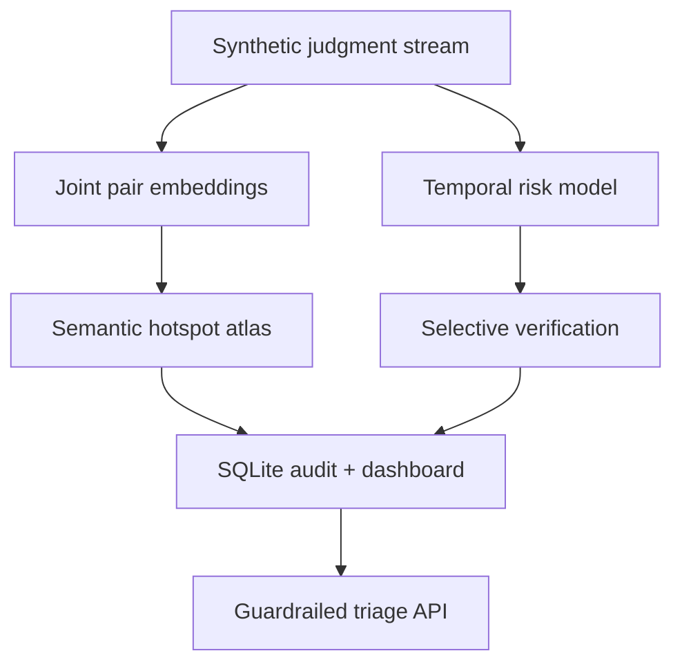

# LLM Judgment Reliability Atlas


An end-to-end research simulation for finding **where** LLM-like judgments become unreliable and routing unstable cases to human or deterministic verification. It connects semantic disagreement hotspots, persona sensitivity, advice-induced reliance, policy-boundary risk, and selective oversight. This is independent portfolio work using fictional judges and synthetic data; it does not evaluate a real LLM or reproduce the attached papers.



## Research problem and alignment

Average agreement can conceal systematic failures. Definition-seeking, ambiguous, and policy-sensitive cases may form localized hotspots; personas may shift subjective annotations; labels can induce over-reliance; plausible plans can still be wrong. These issues directly connect to policy-constrained LLM decision research: probabilistic reasoning is useful, but boundary-sensitive actions require explicit verification.

## Architecture



## Literature synthesis behind the design

| Paper | Evidence used as design motivation |
|---|---|
| Mohtadi & Demartini, *Query–Document Dense Vectors for LLM Relevance Judgment Bias Analysis* (2026) | Disagreement is localized in semantic regions; global metrics hide definition, ambiguity, and policy hotspots. |
| He, Demartini & Gadiraju, *Plan-Then-Execute* (CHI 2025) | Plausible plans can be convincingly wrong; human involvement helps execution but does not automatically calibrate trust. |
| Fröhling, Demartini & Assenmacher, *Personas with Attitudes* (WOAH 2025) | Persona prompting produces repeatable, controllable variation that can resemble human subjectivity. |
| Xu, Han, Sadiq & Demartini, *LLMs in Crowdsourcing Misinformation Assessment* (ICWSM 2024) | LLM labels alter human judgment and search behavior; efficiency gains can accompany over-reliance and propagated errors. |

The papers are cited as conceptual inspiration only. Their text, data, figures, and model outputs are not redistributed.

## Methods

- reproducible synthetic event generator with seed 42 and explicit assumptions
- joint query-document TF-IDF/SVD representation and K-means semantic clustering
- stable chance-adjusted Gwet's AC1 plus directional false-positive/false-negative audits
- persona and intervention sensitivity analysis
- leakage-safe final-batch holdout and global-risk baseline versus gradient-boosted disagreement-risk model
- selective verification evaluated by error capture at a fixed 25% review budget
- SQLite audit mart, SQL operational KPIs, generated dashboard, FastAPI triage contract, Docker, tests, and CI

## Reproduced results

<!-- METRICS_START -->
On the untouched 1,000-event final-batch holdout, global human-simulation/judge agreement was **Gwet's AC1 = 0.335** with **33.3% disagreement**. The constant global-risk baseline achieved **0.500 ROC-AUC**, **0.333 PR-AUC**, and captured **23.1% of errors** at a 25% review budget. The cluster-aware risk model achieved **0.773 ROC-AUC**, **0.626 PR-AUC**, and captured **49.2% of errors** at the same budget - a **113.0% relative gain** - while reducing residual disagreement from **34.1% to 22.5%**. Five of eight semantic clusters exceeded the 20% hotspot threshold. Independent-first intervention reduced simulated disagreement to **24.9%**, versus **35.3%** when a label was shown.
<!-- METRICS_END -->

Results describe the known synthetic mechanism, not real LLM accuracy, human behavior, fairness, or deployment performance.

## Quickstart

```bash
uv sync --frozen --extra dev
uv run python -m judgment_atlas.pipeline
uv run pytest -q
uv run uvicorn judgment_atlas.api:app --app-dir src --reload
```

The committed `uv.lock` fixes the complete dependency graph. Configuration and all simulation/model seeds are fixed in `configs/base.yaml`.

## Outputs

The pipeline writes a cluster atlas, slice audit, holdout triage file, SQLite database, JSON metrics, dashboard, and a locally rebuilt model artifact. See [DATA_CARD.md](DATA_CARD.md) and [MODEL_CARD.md](MODEL_CARD.md).

## Limitations, ethics, and operations

This simulation cannot demonstrate bias in any real model or population. Personas are abstract controls, not demographics. The synthetic reference is assumed correct, clusters depend on representation choices, and review capacity is simplified. Real work must use licensed data, repeated model calls, preregistered hypotheses, uncertainty estimates, qualified annotators, privacy and ethics review, transparent model/version logs, independent policy enforcement, and recourse for affected people.

## License and citation

Code and generated data are MIT licensed. Project citation metadata is in `CITATION.cff`.
